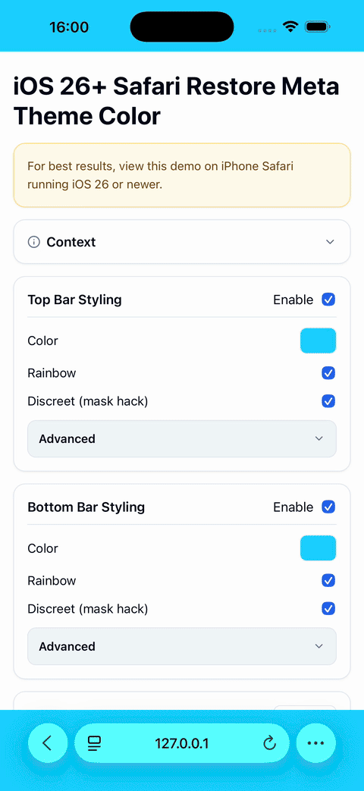

# iOS 26+ Safari Browser UI Tint Control

A workaround to bring back control over Safari's browser UI colors (previously enabled by the `<meta name="theme-color">` tag) on iOS 26+ by leveraging its color-sampling heuristics.

Check out the **[Demo Page](index.html)** for more details and a live example.

